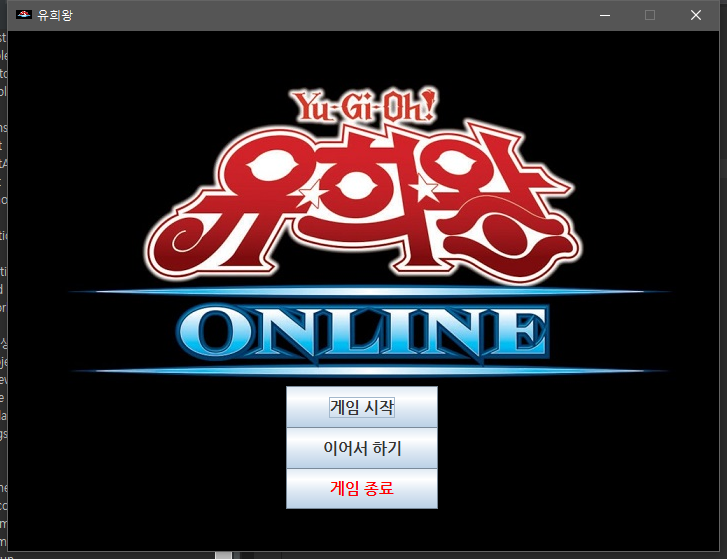
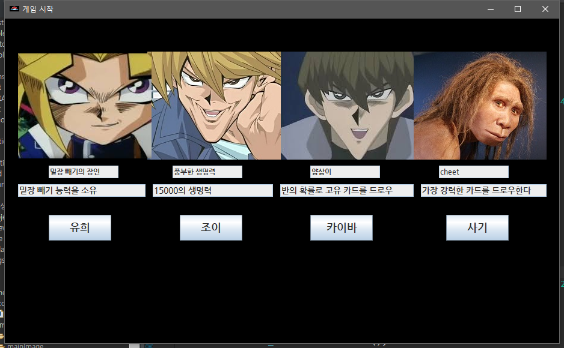
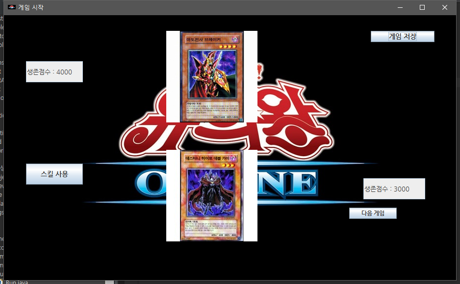

유희왕 미니 카드 게임
==============

#### 주어진 캐릭터를 선택 후 뽑힌 카드에 따라서 승패를 결정. -> 받은 데미지를 생존 점수에서 빼는 게임입니다.

 

## 기획 의도.
처음 기획은 GUI를 이용하여 유희왕 게임을 만들어볼 생각이었으나, 구현해야 할 코드의 분량과 기술적인 한계..   
솔직히 말하면 GUI의 대한 이해도의 부족으로 위와 같이 축소하게 되었음.  
만드는 데 걸린 시간은 약 13시간 이상.

 

## 게임 기능.
* 캐릭터 선택 기능(유희, 조희, 카이바, 치트)
* 각각 선택한 캐릭터에 따른 스킬을 부여함.
* 캐릭터 선택 -> 게임 시작 후 다음 게임을 누르면 카드를 드로우 하면서 뽑힌 카드에 따른 승패를 결정
* 저장하기 기능.
* 이어서 하기 기능. 

 

## 문제.
* '다음 게임' 누르는 코드 구조는 재귀 호출을 이용했기 때문에, 게임이 지속될수록 속도를 비롯한 여러 문제가 생길 우려가 있음.
* GUI 화면을 세 개로 나누어 구성했으나, 이 점에서 Controller클래스를 각각 호출하게 되어 Controller 클래스에서의 몇몇 변수들은 
  static 사용이 불가피하게 되었음 -> 코드의 가독성 및 구조가 효율적이지 않음
* 전체적인 코드들의 더러움.. GUI를 급하게 공부해야 했기 때문에 마무리 작업에 들어가고 나서야, 모든 코드들의 문제점이 보이기 시작함

 

## 소감.
코드가 너무 더러움.. 복잡한 코드들과 호출되는 메서드들이 즉흥적이라 효율적이지 못한 코딩을 한 듯..  
결론적으론 처음에 코딩을 잘못한 탓에 기능을 추가하려면 모든 코드를 뜯어야되는 문제가 생겨버림.  
코딩을 하기 전에 GUI 공부를 먼저 하고 기획을 한 뒤 코딩을 했다면 다른 결과물이 나왔을 것이란 생각이 든다.

 

> ## 실행화면
 

